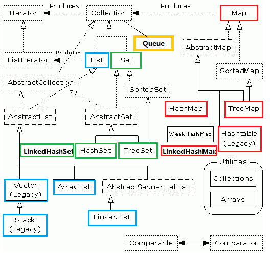

## Content
- basics
- OO
- data structure
- thread

---
## Basics
### Data TYPE
- 整型: byte, short, int, long
- 浮点: float, double
- 字符: char
- 真值: boolean

### tips
- 字符串不可以改变内容, 可以使得字符串共享
- 字符串常量是共享的
- 对经常编辑的字符串, 使用`StringBuilder`
- `String`, `StringBuffer`, `StringBuilder`: `String`不可变, `StringBuffer`线程安全, `StringBuilder`线程不安全
- 输入: `Scanner in = new Scanner(System.in);`
- java不能在嵌套的两个块中声明相同的变量
- `switch`的类型可以为`char, byte, short, int`, 枚举常量, 字符串字面量(since SE 7)
- 大数值: `BigInteger`, `BigDecimal`
- 数组拷贝: int[] copiedArr = Arrays.copyOf(<arr>, <len>)
- java中`[]`运算符被预定义为检查数组边界
- 命令行参数, 与c++不同, java不包含程序名称

## OO
- 域初始化:
    - java中可以在类定义中, 直接将一个值赋给任何域.
    - c++中不能直接初始化类的实例域, 需要使用初始化列表
    
```
// java
class haha {
    private String name = "haha";
    // ...   
}
// c++
class haha {
 public:
    haha(): name("haha") {}
private:
    std::string name;
}
```
      
- java可以在一个构造器的第一句调用其他构造器, c++不可以
- java初始化数据的方法
  - 在构造器中设置值
  - 在声明中赋值
  - 初始化块: 使用`{}`包裹初始化语句块
- java调用构造器的具体处理步骤:
  - 所有数据被初始化为默认值(0, false, null)
  - 按照在**类声明中的出现的次序**, 依次执行所有域初始化语句和初始化块
  - 如果构造器的第一行调用了其他构造器, 则执行第二个构造器主体
  - 执行这个构造器的主体
- java不支持析构器, 可以为类添加`finalize`方法
- 静态导入: `import static java.lang.System.out`
- java中都是公有继承, 不支持多继承
- 如果子类的构造器没有显式调用超类的构造器, 则将自动地调用超类默认的构造器(没有参数的)
- 函数调用过程:
    - 查看对象的声明类型和方法名
    - 查看调用方法时提供的参数类型
    - 如果是`private, static, final`则执行静态绑定
    - 动态绑定
- 检测对象类型: `if (staff[1] instanceof Manager) ...`, 转换失败则抛出异常
- `abstract`: 抽象类可以包含具体数据和具体方法, 即使不含抽象方法也可以声明为抽象类, 不可以实例化抽象类, 可以定义指向具体对象的抽象类引用变量
- java中`protected`对本包和所有子类可见, 比c++的保护机制安全性差
- Object: 所有类的超类, 具有方法`equals(), hashCode(), toString()`
- 包装器类: Integer, Long, Float, Double, Short, Byte, Character, Void, Boolean
- 反射:
    - Class类:
        - `obj.getClass()`: 获取当前对象的类型实例, 即Class对象
        - `getName()`: 获取类的名字
        - `forName(String)`: 由名字获取类型对象, 若类名不存在则抛出异常
        - `newInstance()`: 创建类的实例
    - Field, Method, Constructor类: 域, 方法, 构造器
        - Method类中有`invoke`方法实现方法的调用
    - Modifier类: 修饰符
- 接口没有实例域和实现方法(old saying), 所有的方法自动地是`public`
    - java8中可以在接口是实现`default`方法, 在函数开头加上`default`
    - fields in interface are all `public static final`, 即不存在实例域, 只有静态域
- 内部类既可以访问自身的数据域, 也可以访问创建它的外围类对象的数据域
  - 可以通过外部类对象, 来创建内部类对象(内部类不能为private)
  - 在内部类不需要访问外围类对象的时候, 应该使用静态内部类
```
// inner class
Outer oo = new Outer();
Outer.Inner ii = oo.new Inner();
// static inner class
Outer.StaticInner i = new Outer.StaticInner();
```
- 定义在方法中的类: 局部类. 不能使用public或private访问说明符号
- 带资源的`try`: `try(获取资源) {} catch(Excaption e){}`
- 断言: `assert 条件;` 或 `assert 条件:表达式`, 默认情况断言被禁用, 在运行时加`-enableassertions`或`-ea`来启用, 启用或禁用断言是类加载器的功能
- 泛型限定: `<T extends Comparable & Serializable>`, 接口也使用`extends`, 多个限制用`&`
- 通配符泛型: `<? extends Employee>`, `<? super Manager>`

## data structure


- Interface: collection(value) && map(key-value)
  - collection: list, queue, set
  - map: map
- concurrent: 一般的容器为了性能, 不提供线程安全性. 在util.concurrent包中, 提供有关并发程序的优化数据结构.(e.g. ConcurrentHashMap, BlockingQueue ...)

## thread
### Concepts:
- 线程的6中状态: New, Runnable, Blocked, Waiting, Timed waiting, Terminated
- 线程优先级: MIN_PRIORITY=1, MAX_PRIORITY=10, NORM_PRIORITY=5
- 守护线程: `t.setDaemon(true)`
- 锁: `ReentrantLock`可重入, 保持一个计数器

### Steps:
- implement `Runnable` OR extends `Thread`
- override `run()`
- new a thread:
```
new Thread(<class implements Runnable>).start();
new Thread(new <class extends Thread>).start();
new <class extends Thread>.start();
```

### synchronized
- 使用范围: 方法区, 代码块
- 方法区:
  - 非静态(对象锁), 静态(类锁)
- 代码块
  - synchronized(this), synchronized(haha.class)
  
