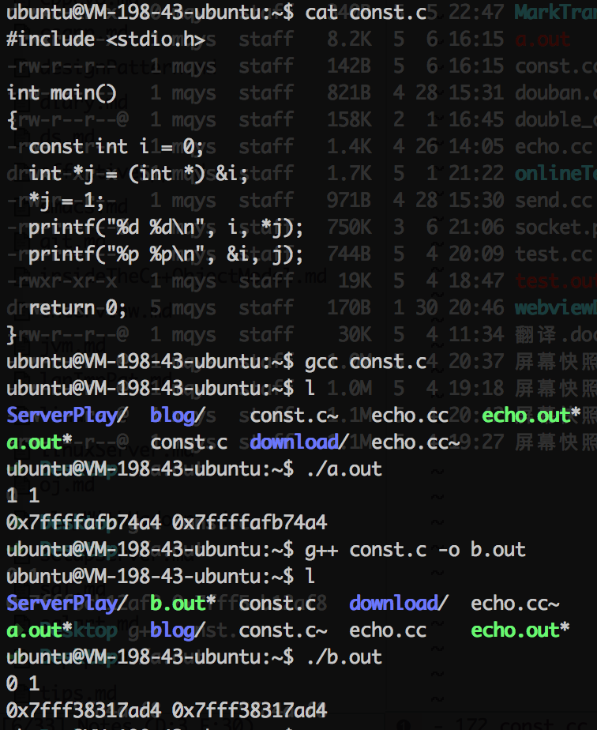

## notes on c++

### 虚函数表
<http://coolshell.cn/articles/12165.html>
对象内存的开始位置保存虚函数表，先父类后子类，若多继承，则有多个虚函数表。如果子类有重载父类函数，则表中的函数地址更新为子类函数的地址。

深入：c++内存模型：<http://coolshell.cn/articles/12176.html>

### 类型转换

```
const_cast          // 去掉const或是volatile属性
static_cast         // 基类与子类，基本数据类型之间，void
dynamic_cast        // 安全的基类与子类之间的转换，必须要有虚函数，交叉转换返回NULL
reinterpret_cast    // 不同类型的指针类型转换
```

### `volatile`
- 易变性：从内存读取变量，而不会从寄存器直接读取
- 不可优化
- 顺序性：volatile变量间的操作不会被优化改变执行顺序，volatile变量与非volatile变量之间的操作可能被交换顺序

### `sizeof` operator not function
- `struct`: 空为 1， 字节对齐：大小为最宽基本类型的整数倍
- 数组：内存字节数，若为形参则返回指针字节数

### 0 or `NULL` and `nullptr`
```
#define NULL 0
//since C++11
#define NULL nullptr

typdef decltype(nullptr) nullptr_t;
```

### 成员初始化列表 VS 构造函数体内赋值
| 成员初始化列表 | 构造函数体内赋值 |
| ------------ | ------------ |
| 定义同时赋值   | 先定义后赋值 |
| 引用成员变量   | | 
| const成员变量 | |
| 没有默认构造函数的类成员函数 | |
- 初始化成员列表顺序按照声明顺序,不是该列表的顺序

### Function objects (functor) (lambda generates functors)
```
template<typename T> 
class Less_than {
    const T val; // value to compare against public:
    Less_than(const T& v) :val(v) { }
    bool operator()(const T& x) const { return x<val; } // call operator 
};

Less_than<int> lti {100};
bool res = lti(99); // true if 99 < 100
```

### Implicit conversion
- `non-explicit` constrator
- overload operator

```
class hello {
public:
    hello(std::string name, int age): _name(name), _age(age) {
        std::cout << "cons " << _name << std::endl;
    }
    
    operator std::string() {
        return std::string(_name + std::to_string(_age));
    }
    
    void sayit() {
        std::cout << "haha " << _name << std::endl;
    }
private:
    std::string _name;
    int _age;
};

    needHello(hello("nini", 99));
    needHello({std::string("keke"), 99}); // still ok
    
    needString("hah");
    needString(std::string("1998"));
    needString(hello("keke", 888));
```

### 重载递增递减运算符号
```
// 后置版本接受一个不被使用的int类型形参
// ++p
p& operator++();
// p++ !!!注意返回的是对象不是引用, 因为返回的修改前的对象 
p operator++(int);
```

### `static`关键字
- C:
    - 退出块后仍然存在的局部变量
    - 不能被其他文件访问的全局变量和函数
- C++:
    - 属于类不属于类对象的变量和函数
    
### 字符数组
```
// 使用字符常量初始化, 初始化化指针， 指向常量区的字符数组，不可以改变
char* str1 = "hello world"; // str1 -> const char *
// str2拷贝常量字符串，复制到自己的内存空间，可以改变值
char str2[] = "hello world";
```

### const 在C与C++中的差异
在gcc和g++下产生以下差异, 在clang和clang++在是一致的


### 继承关系
- 派生类的构造函数需要指明基类的构造方式, 否则使用父类的默认构造函数
- 在调用函数时, 查找当前类型的函数, 若没有则从父类中继续寻找(向上寻找)
  - 输入char, 若没有接受char类型的函数, 则调用接受int类型的函数(若有), 即先在本类中找int, 再到父类中找char

### C++ NOTES 
- int to string `to_string()`

- ***复制构造函数***必须是传引用，否则复制实参会导致自调用死循环

- ***拷贝运算符***必须先检测是否是自赋值,否则内存操作可能出错

- 函数调用时，可能发生参数的隐式类型转换

- 函数类型包括参数类型和返回类型，类的成员函数还包括类名
  
- initialization: use `=` or `{}`
    - use `{}` to avoid conversions that lose infomation, cause error(like double to int)
    - `=` may cause implicit conversion, due to c compatibility

- scope:
    - local:        declaration to block end
    - class:        class start to class end
    - namespace:    declaration to namespace end

- `constexpr`: to be evaluated at compile time
    - 常量表达式中的函数必须被定义为`constexpr`, 该函数只能有`return`语句, `constexpr`函数可以接受变量

- 使用`enum class`来讲`enum`声明为强类型(不可与int类型互用),并且使用class域限制

- `union`配合类型参数一起使用, 不要单独使用

- c/c++中常量字符串在特殊的内存区域, 相同的内容为同一块内存, `char*`指向的是常量字符串

- 不抛异常的函数声明为`noexcept`

```
void use(int sz) noexcept {
    // to do
}
```

- 能在编译时检查的尽量在编译时检查, 使用`static_assert`
```
static_assert(4 <= sizeof(int), "integer too small");
```

- 类内实现的函数被默认为内联函数

- RAII(Resource Acquisition Is Initialization): 在构造对象时获取资源, 在析构对象时释放资源. 将`new` 和`delete`包装在类中, 不直接使用

- 纯虚函数:使用`=0` -> `virtual int size() const = 0`, 子类必须定义继承的纯需函数. 拥有纯虚函数的类是抽象类, 不能被实例化, 只用作接口. 纯虚函数通常没有构造函数, 但是有虚析构函数. 

- 使用`=delete`删除父类的拷贝和移动构造函数, 防止不同子类之间的拷贝和移动.

