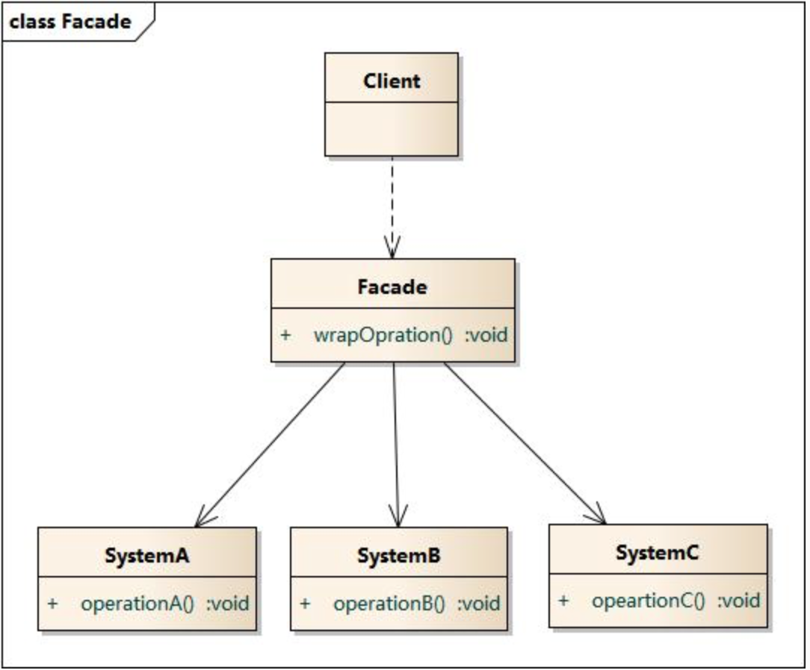

# notes on design pattern

---
### 面向组合子编程

<http://ajoo.iteye.com/?page=3>

---
### 设计模式
- Creational pattern
- Structural pattern
- Behavioural pattern
- Concurrency pattern

<http://design-patterns.readthedocs.org/zh_CN/latest/read_uml.html>

- 开闭原则OCP: 对扩展开放, 对修改关闭
- 迪米特法则: 最少知识原则, 对其他对象尽可能少的了解
- 单一职责原则: 一个类只有一个引起它变化的原因
- 李氏替换原则LSP: 子类可以替换基类
- 依赖倒转原则DIP: 依赖于抽象, 不依赖于具体
- 接口隔离原则: 使用多个隔离的接口, 比使用单个接口要好
- 合成复用原则: 多用组合, 少用继承

## Creational Pattern 创建型

- 简单工厂模式 simple factory / static factory 
  - 根据参数返回不同类的实例, 被创建的类通常具有相同的父类
  - 增加新的产品类的时候不够灵活, 需要修改工厂类的判断逻辑
  - 不满足开闭原则

- 工厂方法模式 factory method
  - ​抽象产品, 具体产品, 抽象工厂, 具体工厂
  - 满足开闭原则
  
- 抽象工厂模式 abstract factory
    - 具体工厂包含产品族
        
- 建造者模式 builder
    - 指挥者, 抽象建造者, 具体建造者
    - 产品由部分组成, 每个部分可以有不同的实现
    - 产品添加建造者, 由建造者来确定各部分的实现
    
- 原型模式 prototype

- 单例模式 singleton
    - 保证一个类只有一个实例

  
    
  

## Structural Pattern 结构型

- 适配器模式 adapter
    - 转换接口, 包装成用户需要的接口

- 桥接模式 Bridge
    - 将类中变化的部分抽取出来独立变化

- 组合模式 composite

- 装饰模式 decorator
    - 使用组合的方式来代替继承
    - 抽象装饰类持有抽象组件成员, 需要增加功能的时候, 实现具体装饰类并增加功能 
    
- 外观模式 facade
    - 外部与子系统通信必须通过外观对象
    
- 享元模式 flyweight
    - 享元工厂类, 抽象享元类, 具体享元类, 非共享具体享元类
    - 对细粒度对象进行共享
    
- 代理模式 proxy
    - 抽象主题角色, 代理主题角色, 真是主题角色

## Behavioral Pattern 行为型

- 职业链模式 chain of responsibility

- 命令模式 commmand
    - 客户类, 接收者类, 调用者类, 抽象命令类, 具体命令类
    - 将请求封装成对象 
    
- 解释器模式 interpreter

- 迭代器模式 iterator

- 中介者模式 mediator
    - 使用中介对象来封装对象之间的交互 
    
- 备忘录模式 memento

- 观察者模式 observer
    - 定义对象间的一对多模式, 使得当一个对象发生变化的时候, 与该对象相关联的对象得到通知并更新

- 状态模式 state
    - 允许对象在其内部状态改变的时候, 同一个行为发生变化

- 策略模式 strategy
    - 定义一系列算法, 将算法进行封装, 使得它们可以相互装换
    
- 模板方法模式 template method

- 访问者模式 visitor

