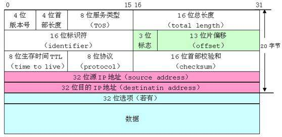
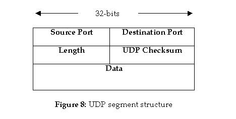
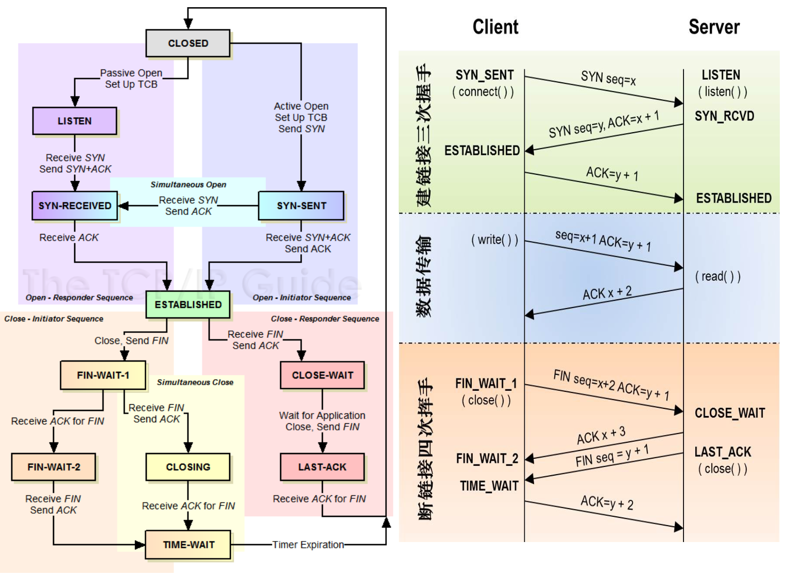

## Protocols
ARP/RARP IP ICMP/IGMP DNS FTP SMTP 

---
### IP (Internet Protocol)


- 数据报中的目的IP的地址始终不发生改变; 每个链路层可能具有不同的数据帧首部, 而且链路层的目的地址始终指的是下一站的链路层地址
- IPv6地址: 8 * 2 = 16字节(128位)
- IP分片: 标识位 + 片偏移
    - 即使丢失一片数据, 也要重传整个数据报(IP没有重传机制, 依靠上层协议)
    - UDP容易导致IP分片
- 校验位: 只覆盖IP首部   
 
---
### UDP (User Datagram Protocol)


- 校验位是可选项, 并且覆盖UDP首部和UDP数据
- 最大UDP长度: IP的16位最大长度限制, 减去首部开销; 实际实现比此理论值小

---
### TCP (Transmission Control Protocol)

协议:
- 可靠的面向连接的字节流运输层服务, 报文段/段(segment), 不能用于广播和多播
- 没有选择确认或否认的滑动窗口协议, 全双工
- 最多有60字节首部, 由4位offset决定, 长度为 offset * 32 bit, 即行数(一行32位, 4字节) 
- 确认号: ACK标志为1, 表示期望收到的下一个序号
- Flags: URG ACK PSH RST SYN FIN
- 窗口: 16位, 最大65535
- 校验: 包含首部和数据, 强制性
- 紧急指针: URG为1时有效, 表示紧急数据的偏移量
- 可选字段: 常见为MSS(Maximum Segment Size)最长报文小大, 通常在建立连接的阶段指明该选项


状态:
- SYN / FIN占用一个序号
- 发送FIN表示在这一方向上数据发送完成, 收到FIN后可以继续发送数据
- 连接建立超时: 间隔时间发送SYN
- 最大报文段长度: 建立连接时通知对方
- 半关闭: 结束发送后还能接受对方数据的能力(使用shutdown, 不是close)
- TIME_WAIT: 2MSL等待状态, 该期间此socket不能再被使用
- 复位报文段: 不存在端口的连接请求 / 异常终止一个连接 / 检测半打开连接
- 同时打开 / 同时关闭

数据流:
- 交互数据流:
    - 经受时延的确认(数据捎带ACK): 
        - TCP在接受到数据时不立即发送ACK, 它推迟发送, 以便将ACK和需要沿该方向发送的数据一起发送. 一般采用200ms时延. 
    - Nagle算法: 
        - TCP连接上最多只能有一个未被确认的未完成的小分组, 在该分组的确认到达之前不能发送其他的小分组. TCP收集这些少量的分组, 并在确认到来时以一个分组的方式发出去
    - 糊涂窗口综合症(Silly Window Syndrome):
        - 现象: 少量数据通过大量连接进行交换, 不是满长度的报文段
        - 原因:
            - 接收方来不及取走所有数据, 返回一个小窗口
            - 发送方未开启Nagle, 不断发送小数据
        - 解决:
            - 接受方不通告小窗口
            - 发送方在数据满足一定长度时再发送                    
- 成块数据流
    - 滑动窗口: 
        - 接收方不必确认每一个收到的分组, ACK是积累的
        - 零窗口: 发送方此时不能发送任何数据
        - 窗口大小增加了两个最大报文长度后发送窗口更新
    - PUSH标志:
        - 发送方: 不要因等待额外数据而使已提交数据在缓存中滞留
        - 接收方: 立即将这些数据递交进程而不能等待判断是否还有额外的数据到达
    - 慢启动:
        - 拥塞窗口(cwnd):初始化为1, 每收到一个ACK, 增加一个报文段
        - 发送方取拥塞窗口和通告窗口的最小值作为发送上限
        - 拥塞窗口是发送方的流量控制, 通告窗口是接收方的流量控制
    - 带宽时延乘积:
        - capacity(bit) = bandwidth(b/s) * round-trip time(s)

超时与重传:
- 定时器:
    - 重传定时器
    - 坚持(persist)定时器
        - TCP不对ACK报文进行确认, 只确认含有数据的ACK报文段
        - 若窗口为0, 此后重置窗口ACK报文段丢失, 则进入死锁
        - 发送方使用坚持定时器来周期性查询, 窗口是否已经增大
        - 坚持计时器到时, 则发送一个字节的数据
    - 保活(keepalive)定时器
    - 2MSL(Maximum Segment Lifetime)定时器
- RTO(Retransmission TimeOut): 由RTT计算得出
- Karn算法:
    - 当一个超时和重传发生时, 在重传数据的确认最后到达时, 不能更新RTT估计器
- 拥塞避免算法:
    - 分组丢失:
        - 超时
        - 接受到重复的确认
    - 拥塞避免算法和慢启动, 维持两个变量: 拥塞窗口(cwnd) 和 慢启动门限(ssthresh)
    - 拥塞发生时, ssthresh设置为cwnd的一半, cwnd设置为1(超时) / ssthresh加上3倍报文长度(重复确认)
    - cwnd小于或等于ssthresh执行慢启动, 否则执行拥塞避免
    - 慢启动 -> 指数增长(收到一个确认加1), 拥塞避免 -> 线性增长(收到一个确认增加1/cwnd)
- 快速重传和快速恢复:
    - 快速重传: 收到3个及以上重复ACK, 重传丢失数据报文段
    - 快速恢复: 发生快速重传后, 执行拥塞避免而不是慢启动

补充:
- SACK(Selective Acknowledgment): 选择ACK, 确认包含确认的起始和结束   
- FACK(Forward Acknowledgement) 
- [TCP上](http://coolshell.cn/articles/11564.html)
- [TCP下](http://coolshell.cn/articles/11609.html)

---
### FTP (File Transfer Protocol)
- 两个TCP连接来传输一个文件
    - 控制连接: 一直保持
    - 数据连接: 根据需要

--- 
## Tools
```
ifconfig
netstat
ping
traceroute
telnet
tcpdump
```